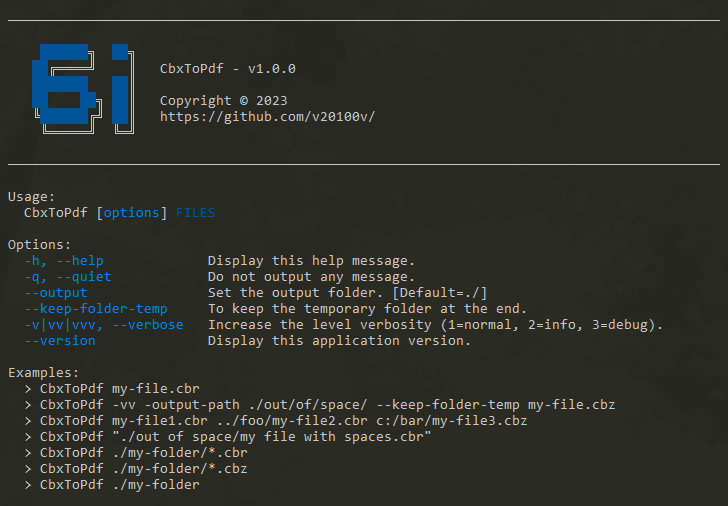

CbxToPdf
========

[](https://github.com/v20100v/6i-Jekyll/blob/develop/LICENSE.md)
[](https://www.buymeacoffee.com/vincent.blain)

> Windows batch used to convert cbr or cbz file into pdf, with support for converting webp images.



## Features

- Convert a cbr and a cbz file into PDF.
- Batch processing of one or multiple given folder. All cbx files in given folder are convert in PDF.
- Convert images (webp support) before Pdf generation.
- Handle of several levels of verbosity (--quiet, -v=normal, -vv=info or -vvv=debug)
- Set output folder, where all PDF are generated.
- Use a file config.ini to set binary dependencies, and configure the process of conversion according to the ImageMagick's parameters.


## Install

1. Get `./CbxToPdf.bat` and `config.ini` files. 


2. CbxToPdf use [7-Zip](https://www.7-zip.org/) to unpack cbx files. It also use [ImageMagick](https://imagemagick.org/index.php) to convert images and generate PDF. To install this binary dependencies, you can use a package manager for Windows, like [chocolatey](https://chocolatey.org/).

```
> choco install 7zip imagemagick
```

3. Notes, if you install these binaries in a different folder than the default, then you need to update the `config.ini` file accordingly.

```ini
; ./config.ini
[BinaryDependencies]
ZIP_BIN="C:\Program Files\7-Zip\7z.exe"
IMAGE_MAGICK_BIN="C:\Program Files\ImageMagick-7.1.1-Q16-HDRI\magick.exe"
```

4. Test with

```batch
> CbxToPdf --help
```


## Usages

### Convert a single cbx file

Notes, if the given file have a blank space into this path, you need to put double quotes. The generated PDF is saved by default into `./output` folder.

```batch
> CbxToPdf "./test/file 1.cbr"

; Result
╔═════════════════════╗
║  1. Initialization  ║
╚═════════════════════╝
Ok, one cbx file was found to be converted.

╔════════════════════════╗
║  2. Convert cbx files  ║
╚════════════════════════╝
Launch conversion of the file: file 1.cbr
Ok, the file file 1.pdf was saved into D:\6i\CbxToPdf\output\

Job is done !
```

### Convert multiple cbx file by given one ore multiple folder

You can give multiple relative path. The program search into these folders all cbr and cbz files. And you can filter the cbx file type by using the expression `*.cbz` into the path.

```batch
> CbxToPdf "./folder 1" "./folder 2" "../../folder 3/*.cbz"
```

### Convert with no output (quiet)

Only errors are printed in console output.

```batch
> CbxToPdf --quiet "./folder 1" 
```

### Increase the level verbosity

Only errors are printed in console output.

```batch
# Normal output
> CbxToPdf -v "./folder 1"

# Info output
> CbxToPdf -vv "./folder 1"

# Debug output
> CbxToPdf -vvv "./folder 1" 
```

### Change the output folder

To generate PDF into another folder.

```batch
> CbxToPdf --output ../saved "./folder 1" 
```


## About

### Support

CbxToPdf is free and available as open source under the terms of the [MIT License](./LICENSE.md), but if you want to support me, you can [buy me a coffee here](https://www.buymeacoffee.com/vincent.blain) !

### Contributing

Bug reports, reports a typo in documentation, comments, pull-request & Github stars are always welcome !

### Release
CbxToPdf v1.0.0 - 29/05/2023


### License

Release under [MIT License](./LICENSE.md).
Copyright (c) 2023 by 2o1oo vb20100bv@gmail.com